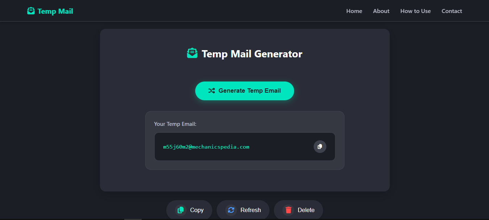

# 📧 Temp Mail Generator

A modern, responsive temporary email service that provides instant disposable email addresses to protect your privacy and avoid spam. Built with vanilla JavaScript and powered by the Mail.tm API.




---

## ✨ Features

- **🚀 Instant Email Generation:** Create temporary email addresses with a single click
- **📋 One-Click Copy:** Copy email addresses to clipboard instantly
- **📬 Real-time Inbox:** Automatic inbox refresh every 5 seconds
- **📱 Responsive Design:** Works seamlessly on desktop, tablet, and mobile devices
- **🔄 Auto-Refresh:** Manual and automatic inbox refresh capabilities
- **📧 Message Viewer:** Click to expand and view full email content
- **🗑️ Quick Delete:** Delete current email and generate a new one
- **🎨 Modern UI:** Clean, dark-themed interface with smooth animations
- **🔒 Privacy-Focused:** No registration required, completely anonymous
- **⚡ Fast & Lightweight:** Pure vanilla JavaScript, no frameworks

---

## 🛠️ Technology Stack

- **Frontend:** HTML5, CSS3, Vanilla JavaScript (ES6+)
- **Styling:** CSS Custom Properties (CSS Variables), Flexbox, Grid
- **Icons:** Font Awesome 6.5.1
- **API:** [Mail.tm](https://mail.tm/) - Free temporary email API
- **Browser APIs:** Clipboard API, Fetch API

---

## 📋 Prerequisites

- Modern web browser with JavaScript enabled
- Internet connection for API access
- No additional software installation required

---

## 🚀 Getting Started

### Option 1: Direct Download

1. **Download the project:**

   ```bash
   git clone https://github.com/AadityaGeek/temp-mail-generator.git
   # Or download as ZIP and extract
   ```

2. **Navigate to the project directory:**

   ```bash
   cd temp-mail-generator
   ```

3. **Open in browser:**
   - Open `index.html` in your web browser
   - Or use a local server (recommended for development)

### Option 2: Local Development Server

- **Using Python:**

  ```bash
  python -m http.server 8000
  ```

- **Using Node.js:**

  ```bash
  npm install -g http-server
  http-server
  ```

- **Using Live Server (VS Code extension):**
  - Install "Live Server" in VS Code
  - Right-click on `index.html` and select "Open with Live Server"

---

## 📖 Usage

1. **Generate Email:** Click the "Generate Temp Email" button to create a new temporary email address.
2. **Copy Address:** Use the copy button (📋) to copy the email address to your clipboard.
3. **Check Messages:** The inbox automatically refreshes every 5 seconds to show new emails.
4. **View Messages:** Click on any message in the inbox to expand and view its full content.
5. **Refresh Manually:** Use the refresh button (🔄) to manually check for new messages.
6. **Delete & Regenerate:** Click the delete button (🗑️) to remove the current email and generate a new one.

---

## 📁 Project Structure

```text
temp-mail-generator/
├── index.html          # Main HTML file with complete UI structure
├── style.css           # CSS styles with modern design and responsive layout
├── script.js           # JavaScript functionality and API integration
├── images/
│   └── temp-mail-generator.png  # Screenshot
└── README.md           # Project documentation (this file)
```

---

## 🔧 Configuration

The application uses the Mail.tm API with the following endpoints:

- **Domains:** `https://api.mail.tm/domains`
- **Account Creation:** `https://api.mail.tm/accounts`
- **Authentication:** `https://api.mail.tm/token`
- **Messages:** `https://api.mail.tm/messages`

No additional configuration is required.

---

## 🤝 Contributing

Contributions are welcome!

1. **Fork the repository**
2. **Create a feature branch:**

   ```bash
   git checkout -b feature/amazing-feature
   ```

3. **Make your changes:**  
   - Follow the existing code style  
   - Test your changes thoroughly  
   - Ensure responsive design is maintained
4. **Commit your changes:**

   ```bash
   git commit -m 'Add some amazing feature'
   ```

5. **Push to the branch:**

   ```bash
   git push origin feature/amazing-feature
   ```

6. **Open a Pull Request**

**Development Guidelines:**

- Use vanilla JavaScript (no frameworks)
- Maintain responsive design principles
- Follow existing CSS custom property patterns
- Ensure cross-browser compatibility
- Add appropriate error handling

---

## 📄 License

This project is licensed under the MIT License. See the [LICENSE](LICENSE) file for details.

---

## 👨‍💻 Author & Contact

### Aaditya Kumar

- 🌐 GitHub: [@AadityaGeek](https://github.com/AadityaGeek)
- 💼 LinkedIn: [aadityakr](https://linkedin.com/in/aadityakr)
- 📧 Email: [work.aadityakumar@gmail.com](mailto:work.aadityakumar@gmail.com)

---

## 🙏 Acknowledgments

- **[Mail.tm](https://mail.tm/):** For the free API service
- **[Font Awesome](https://fontawesome.com/):** For the icons
- **Community:** Thanks to all contributors and users

---

## ⚠️ Important Notes

- **Temporary Use Only:** Do not use for important accounts or financial services
- **No Permanent Storage:** Messages are not stored permanently
- **Privacy:** Temporary emails are not suitable for sensitive communications
- **API Dependency:** This application depends on the Mail.tm API service availability

---

## 🔮 Future Enhancements

- [ ] Email forwarding capabilities
- [ ] Custom domain selection
- [ ] Message search functionality
- [ ] Email export options
- [ ] Dark/Light theme toggle
- [ ] Multiple email management
- [ ] Browser extension version

---

**⭐ If you find this project useful, please consider giving it a star on GitHub!**
